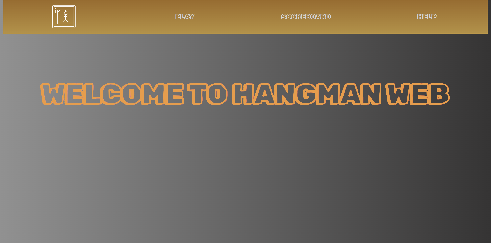

# HangmanWeb 🪢

Welcome to HangmanWeb ! This project is based on the famous HangMan Game



# Prerequisite :rewind:

Somes knowledges in this field : 

- The use of Golang 
- The use of Git and for the code management

# Installation :wrench:

1. Clone the repository.
```bash
  git clone https://ytrack.learn.ynov.com/git/mkilian/HANGMAN-WEB.git
```
2. Reach in the repository.
```bash
  cd HANGMAN-WEB
```

# Start :technologist:

1. Write this command : 
```bash
  go run main.go
```

2. Your application running on port 8080 is available then you can open it in browser. If you don't have the message for open it you can write this in your browser:
```bash
  http://localhost:8080/
```
3. You can find my mockup here :
https://www.figma.com/file/5AeIylXfoXAawD8nwkm7ZE/Hangman-Web-Kilian-Moun?type=design&node-id=19%3A10&mode=design&t=V7WYwncUPgw3gmYS-1

# How Play ? :hammer:

Let’s name José the poor man that will be hanging to this rope if you lose.

The aim is to find the word that the computer chose. The player can suggest either a word or a letter among the 26 letters of the alphabets to find the word. You can't use 2 times the same letters and you will have 10 attempts to complete the game. When the player suggest a word, if the word is found the game stops, if not, the counter of attempts decrease by 2.
The program continues until the word is either found, or the numbers of attempts is 0. 

When you start you can choose between the logo, "play", "scoreboard", "help".

1. The logo allows you to return to the menu

2. The icon "play" allows you to play HangmanGame, you have to write your username first and then choose the level you wants to play. When you are in the game you have 3 boxs the first print the hangman if you makes mistakes. The second print the word to find and the words already use. The last one is the user input.

3. "scoreboard" allows you to see the top 10 of the game. If you win you have point like this :

                                                   Level     |    Points
                                               ------------- | -------------
                                                   easy      |       1
                                                  medium     |       2
                                                   hard      |       3

The point you win is multiply by the numbers of attempts left. If you loose you don't win points.

4. The icon "help" can help you and gives you somes informations about the game. Moreover, you can find my contacts in this section.

# Version :card_file_box:

golang 1.21.0

# Authors :money_with_wings:

 - [Kilian Moun :beers:](https://github.com/MounKilian)